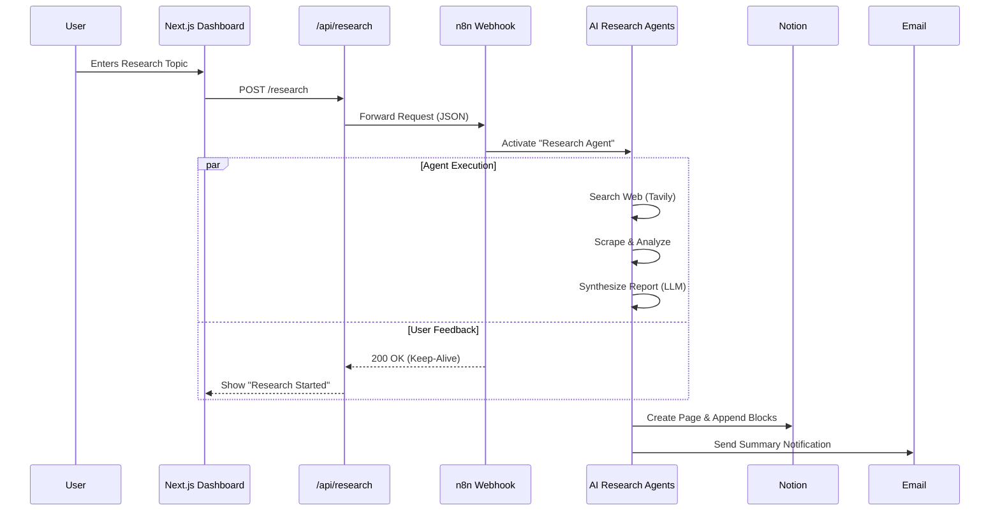

# 🏗️ System Architecture

This document outlines the technical design and data flow of the Antigravity Research System.

## High-Level Data Flow

The system operates on an event-driven architecture triggered by the user via the Web Dashboard.

## Component Details

### 1. The Frontend (Client Layer)
*   **Framework**: Next.js 15 (App Router).
*   **State Management**: React Hooks (`useState`, `useEffect`) for simple local state.
*   **Animations**: `framer-motion` handles the complex UI transitions (loading rings, glass panels).
*   **Communication**: Uses `axios` to communicate with the internal API route.

### 2. The API Layer (Proxy)
*   Located at `src/app/api/research/route.ts`.
*   Acts as a secure proxy between the browser and the n8n webhook.
*   Prevents exposing the raw n8n webhook URL and credentials to the client-side.

### 3. The Automation Layer (Logic)
*   Hosted on a private n8n instance.
*   **Workflow ID**: `0HjNCQ8MF6eyBhyzZSQ8l`
*   **Trigger**: Webhook (POST).
*   **Nodes**:
    *   **Tavily**: For high-quality, hallucination-free web search.
    *   **LangChain Agent**: For recursive reasoning and data synthesis.
    *   **Notion Node**: For structured database insertion.

## DevOps & Infrastructure

The project uses a "Infrastructure as Code" approach for the automation layer, managed by a custom Python CLI.

*   **Workflows as JSON**: The actual logic of the AI agents is exported to `automation/research_agent_workflow.json`.
*   **Versioning**: This JSON file is committed to Git, allowing for rollback and code review of logic changes.
*   **Deployment**: The `workflow_manager.py` script handles the `push` (deploy) and `pull` (backup) operations.
